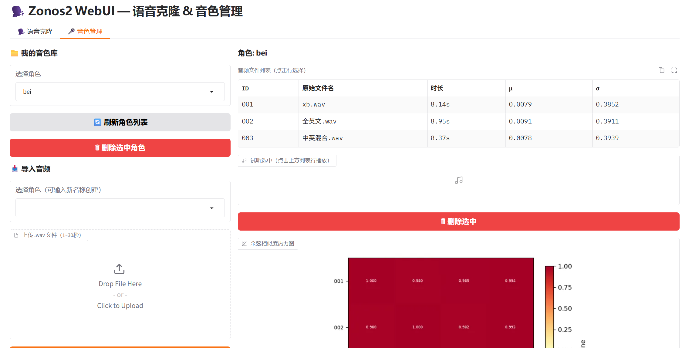
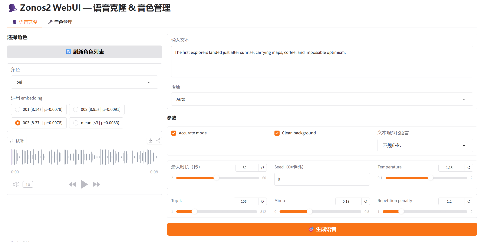

# Zonos2 WebUI

 Zonos2是我目前测试的效果最好的语音克隆。官方有简单的webui但是不太好用，我就手动写了一个新的，顺带研究一下Zonos2和具体的工作原理。

Zonos2 的语音克隆采用了一种完全端到端、一步到位的直接注入机制，这与传统的“先生成文本对应音频再进行后期变声（Voice Conversion）”有本质区别。

系统提取参考音频的 `Speaker embedding` 后，直接将其作为前缀帧（Prefix Frames）拼接在自回归输入序列的最前端。

大语言模型（LLM）自回归地预测每一个后续的音频 Token 时，前缀中的声纹特征始终作为强烈的条件上下文（Conditioning Context）参与注意力机制（Attention）计算，所以就会有声调的变化。模型在输出音频 Token 的瞬间，便已经完成了“文本内容”与“目标音色”的深度融合，不存在独立的内容生成与音色转换步骤。

代码里面生成的参数中设置 `speaker_embedding = None`，则会自动跳过前缀帧注入，LLM 将切换为默认的基质音色进行纯文本到语音（TTS）的合成。

## 声音嵌入

Zonos2 目前不支持通过纯文字描述来生成或修改音色，所以他获取参考音频的方法是用 `Qwen3-Voice-Embedding-12Hz-1.7B` 这个单向音频特征提取模型获取内部表征空间（Latent Space）输出为固定的 2048 维向量。

> 因为Qwen3-Voice-Embedding也会embeding说话人的情绪、语速和说话风格，所以我增加了一个mean选项就是将多个embeding 进行平均，可以让语气更稳定一些。如果想用特定的情绪也可以用特定情绪的音频来做embedding

##  音频解码：DAC 声码器角色

Zonos2 的大语言模型（LLM）核心输出并非可以直接播放的模拟或数字波形，而是高维、离散的音频离散编码标记）。

DAC (Descript Audio Codec)充当高性能声码器（Vocoder）和音频解码器的角色。

* LLM 的职责：解决“在给定的目标音色下，当前文本应该怎么说、语气如何、声学环境怎样”，并输出一系列编码代号。
* DAC 的职责：负责“将这些抽象的编码代号无损、高保真地还原为人类可听的数字音频信号”，最终解码输出为 44.1kHz 的高采样率 PCM 波形。

## 本项目的数据流向

以下为 Zonos2 从参考音频输入、音色持久化到最终语音合成的完整数据闭环：

```text
参考音频 (.wav)
      │
      ▼
Qwen3-Voice-Embedding-12Hz-1.7B (音频信号 ──> 离散 2048 维向量)
      │
      ▼
.npy 特征文件 (持久化序列化至本地目录: voices/角色名称/embeddings/)
      │
      ▼
加载至内存 ──> 赋值给 TTSUserMsg.speaker_embedding
      │
      ▼
注入 LLM (作为前缀帧拼接至序列头部，伴随自回归过程指导每一个 Token 生成)
      │
      ▼
LLM 输出高质量离散 Audio Codebook Tokens
      │
      ▼
DAC 声码器接收 Tokens ──> 神经解码 ──> 44.1kHz PCM 原始音频流
      │
      ▼
前端 WebUI 播放器 / 音频文件导出
```

## 界面

音色管理、官方的把音色的嵌入放到内存中了，我这边改了下直接保存在voice目录下，这样可以复用，也减少内存消耗




语音克隆



## 安装说明

cache目录是项目所有需要用到的

```
 zonos2-webui/cache/
  ├── models/                                    模型目录
  ├── Qwen3-Voice-Embedding-12Hz-1.7B/           千问的embeding
  ├── dac_cache/                                 dac模型
  ├── huggingface/                               临时文件
  └── matplotlib/                                临时文件
```

模型下载地址：

https://huggingface.co/marksverdhei/Qwen3-Voice-Embedding-12Hz-1.7B

https://github.com/descriptinc/descript-audio-codec/releases/download/0.0.1/weights.pth

zonos2是官方的代码，我为了方便就直接使用了：

https://github.com/Zyphra/ZONOS2/tree/main/python/zonos2

## 运行

```
pip -r requirements.txt
python app.py
```


